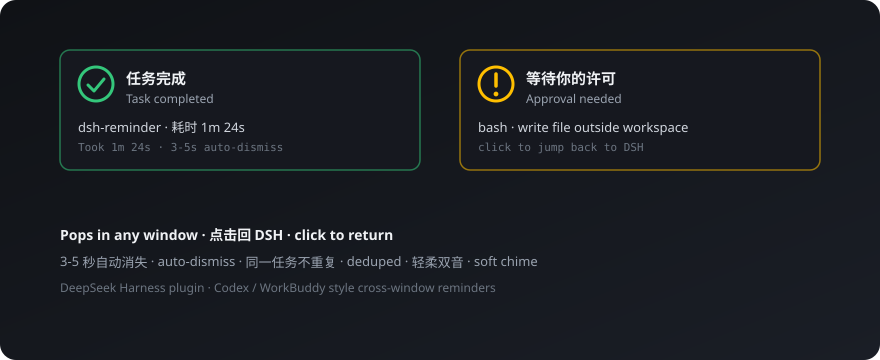

# dsh-reminder

<p align="center"><a href="README.md">English</a> · <b>简体中文</b></p>

**DSH 跨窗口提醒插件**——你在别的窗口忙时，任务**完成**或**需要许可**，它就在屏幕右下角轻轻叫你一声。



---

## 功能

| 功能 | 说明 |
|------|------|
| 任务完成提醒 | 每个回合结束弹出「任务完成」：会话名 · 耗时 + 绿色对勾图标 |
| 审批提醒 | 出现等待许可的操作时弹出「等待你的许可」+ 工具名 + 琥珀感叹图标 |
| 任何窗口都弹 | 切到其他应用也照样弹，不用守着页面 |
| 点击回 DSH | 点通知直接回到 DSH 界面并打开对应会话 |
| 3-5 秒自动消失 | 不打扰，稍纵即逝（时长可调） |
| 轻柔双音 | D4→A4 双音符提示音，不吓人 |
| 智能去重 | 同一任务 / 同一审批只弹一次 |
| 只提醒不代劳 | 绝不替用户审批 |

---

## 为什么需要

- **审批没人叫**：Agent 卡在等许可，你却不知道 → 现在有琥珀色提醒
- **完成没人说**：任务跑完无提示，只能来回切窗口 → 现在有绿色提醒

---

## 快速开始

1. **安装**：`dsh plugin --profile web add <dsh-reminder>`（或 `npm i dsh-reminder`），把 `dsh-reminder` 加进 profile 的 bundle 组合，重启 DSH web 进程
2. **开权限**：设置 → 提醒 →「开启并测试通知」→ 浏览器弹窗选允许，立即收到一条测试通知
3. **坐等提醒**：切到别的窗口干活，任务完成或需要许可时右下角见

---

## 设置

| 设置项 | 默认 | 说明 |
|---|---|---|
| 桌面通知权限 | 未授权 | 一键授权 + 测试通知 |
| 审批提醒 | 开 | 关闭后不弹审批通知 |
| 完成提醒 | 开 | 关闭后不弹完成通知 |
| 通知停留时长 | 3-5 秒 | 自动消失秒数 |
| 失败/取消提醒 | 关（预留） | 后续版本规划 |

---

## 架构

DSH 插件 = **host Cordis 插件 + Web 客户端**同包分发：

- **host**：注册 reminder 设置命名空间 + 自有 Typert Remote（reminder/getSettings·updateSettings）——插件命名空间不在 Web 设置 API 白名单内，故走自建通道
- **client**：订阅会话列表与当前会话快照（turn/end、approval/requested 经 mux 流直达浏览器），Notification API 弹窗 + Web Audio 双音
- **只读**：绝不修改 DSH 核心行为

---

## 开发

```bash
npm install
npm run typecheck   # tsc --noEmit
npm test            # tests/unit 下的单元测试
npm run build       # esbuild：host ESM + 客户端单文件产物
```

- 构建产物：`lib/index.js`（host ESM）、`lib/client.js`（客户端）、`lib/types/`（.d.ts）
- 宿主端构建不能把 `@deepseek-ai/dsh-*` 标记为 external（profile 运行时按真实路径解析）；peer 依赖按上方声明保持 optional。

---

## 已知约束

- Chrome 页面通知**不支持按钮**（actions 仅 ServiceWorker 持久通知可用）——关闭方式：自动消失 / 悬停系统关闭按钮
- 通知权限必须**用户手势**申请（浏览器安全规定）——设置页按钮一键完成
- 提示音需首次点击解锁（Web Audio 自动播放策略）

---

## 来源

上游：[Aisland-SJL/dsh-reminder](https://github.com/Aisland-SJL/dsh-reminder)。本目录为本地构建副本（上游 tarball 不含 `lib/`），已完成本地化；行为与上游 v0.1.0 一致。

## 许可证

[MIT](LICENSE)
